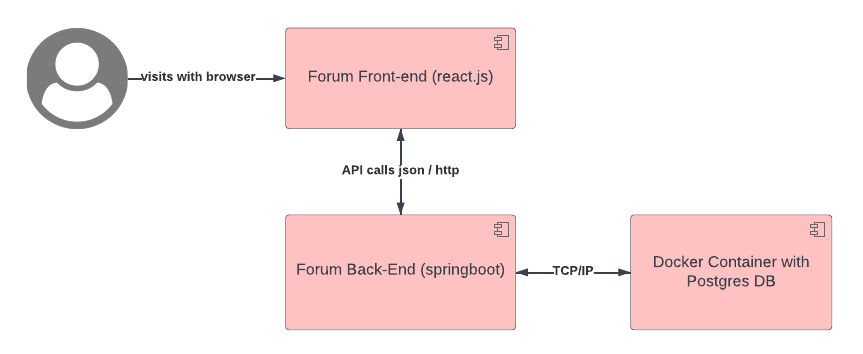
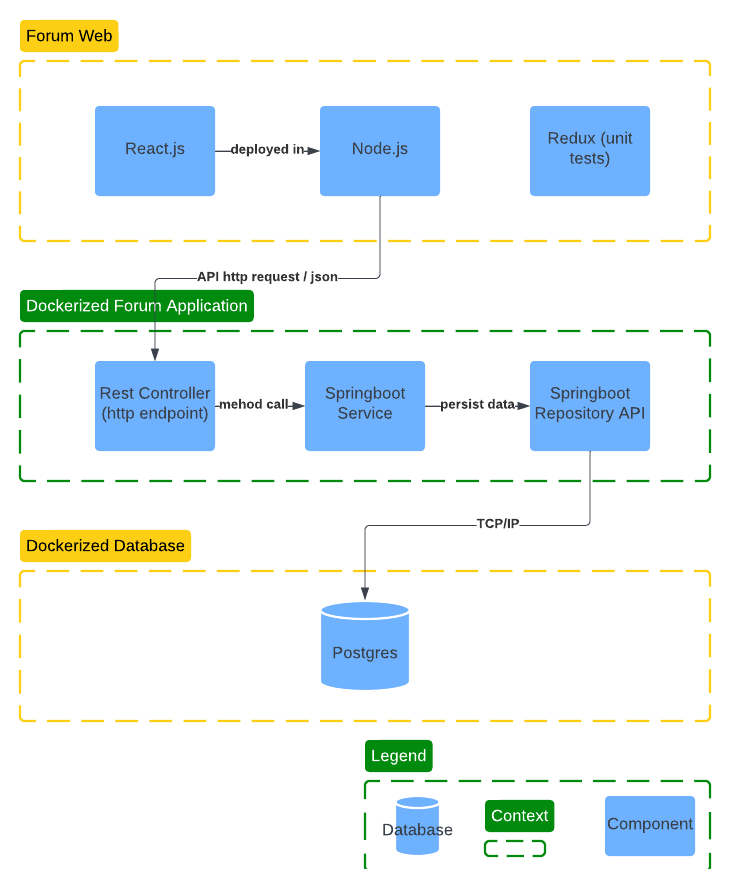

# About
This is the back-end of a simple forum application.

# TODOs
- add role to the user - martin
- add users to the topics and replies - Sezen
- flyway db scripts - ivo
- implement soft delete - for future development

# Design
This design is documented using a simplified [C4 model](https://c4model.com/)

# Context View
TODO: add

# Container View

# Component View

